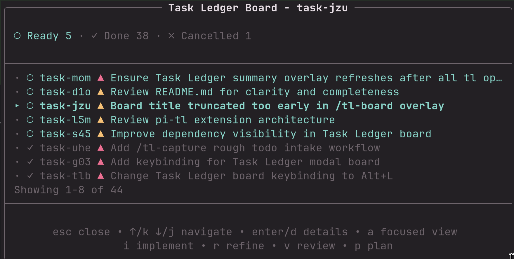

# @aholbreich/pi-tl

Pi extension package for [`tl`](https://github.com/aholbreich/tl), the Git-native TaskLedger CLI.

This package shells out to the local `tl` binary. It does not bundle or install `tl`.



## Requirements

- `pi`
- `tl` available on `PATH`
- Run Pi from a repository initialized with `tl init` for normal use

## Installation

```sh
pi install npm:@aholbreich/pi-tl
```

Or install from local sources:

```sh
pi install /home/aho/git/pi-tl
```

For project-local installation, add `-l`:

```sh
pi install -l npm:@aholbreich/pi-tl
```

## Try locally

From any repository where you want to use TaskLedger:

```sh
pi -e /home/aho/git/pi
```

## Agent usage

The extension intentionally does **not** mirror the full `tl` CLI as Pi agent tools. The agent should use plain `tl ...` commands directly for normal ledger work (`tl ready`, `tl show`, `tl claim`, `tl note`, `tl close`, etc.). This keeps the extension from drifting behind upstream `tl`.

One helper remains because it adds orchestration beyond a single CLI call:

- `tl_bulk_create` - create multiple task ledger tasks sequentially from a user-approved cleaned list and report partial failures.

When `.tl/` exists in the current repository, the extension nudges the agent to use the normal task ledger workflow through the `tl` CLI: ready → claim → note → close/block/pending/cancel/release.

## Commands

A live Task Ledger overlay is shown above the editor when the current repository has a ledger and at least one ready/in-progress/blocked/pending/stale task. It keeps `tl` as the source of truth by refreshing from `tl --json` output on session start, compaction/tree navigation, and successful `tl_bulk_create` executions. Use `Alt+T` to show/hide this passive overlay during the current session. The footer status shows the installed `tl` version plus compact colored counts, for example `tl 0.9.0: ○3 ▲1`.

Human-facing commands focus on the overlay workflow. Agent tools keep color disabled for clean JSON/model output.

- `/tl-capture` - open an editor for rough todos, then ask the agent to refine and create clean tasks
- `/tl-board` or `Alt+L` - open a keyboard-navigable modal board for ready, waiting, in-progress, blocked, pending, and stale tasks; use arrows/j/k to move, enter/d for in-modal details, b/esc to return, i/r/v/p for implement/refine/review/plan, `c` to cancel with a reason, `x` to remove with a reason, and `a` to toggle between focused (active) and all (including done/cancelled) views
- `/tl-init` - initialize task ledger after confirmation

The board's **Waiting** (`◌`) section keeps open tasks that are not ready
(including tasks waiting on prerequisites) visible in both views. This is
separate from explicitly **Blocked** tasks. Open a task's details with `enter`
or `d` to inspect its **Depends On** information.

**All** uses the complete `tl list --all --json` inventory, including
Done/Cancelled and any unrecognized statuses under **Other**. Each task appears
once; stale claims take precedence over other non-closed sections. The passive
overlay remains a compact actionable summary, not the full board inventory.

## Development

```sh
npm install
npm run check
npm test
```

Generate Markdown release notes from commits since the last tag:

```sh
npm run release-notes                 # print to stdout
npm run release-notes -- -o NOTES.md  # write to a file
```

Pi loads TypeScript extensions directly, so no build step is required.
